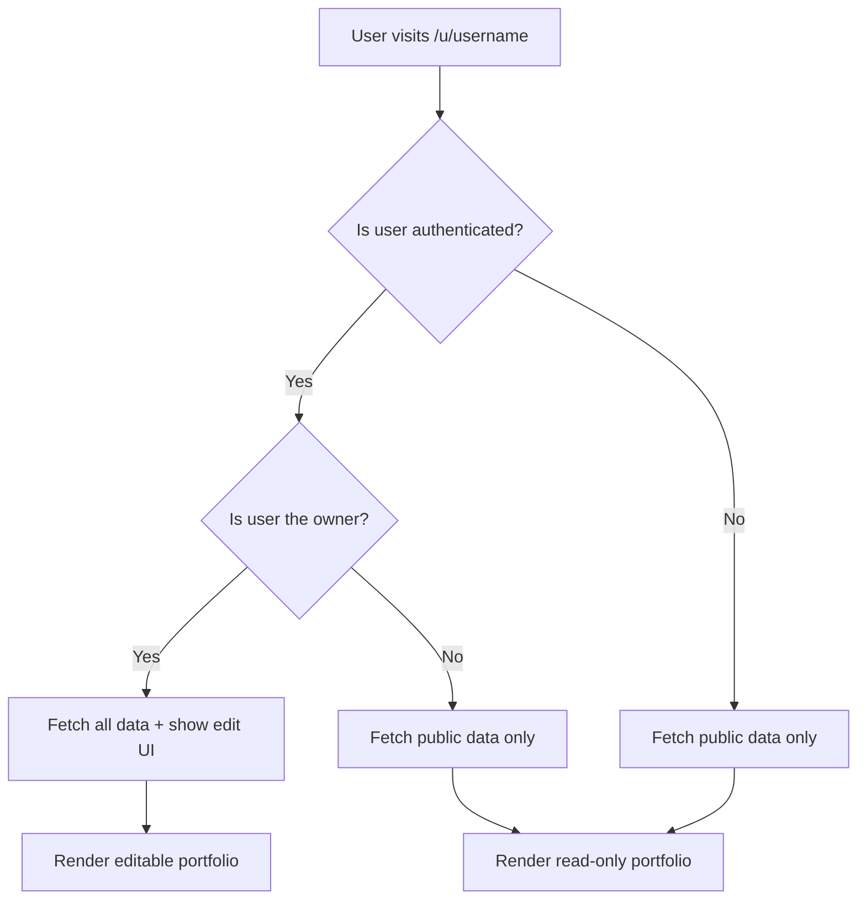

# 🏗️ Unified Portfolio Architecture - Senior Engineering Analysis

## 🎯 **Executive Summary**

As a senior software engineer, I've analyzed the current architecture and identified critical UX inefficiencies. The solution is a **unified portfolio page** that serves both public and private modes - eliminating UI duplication while providing a seamless experience.

## 🔍 **Current Architecture Problems**

### **❌ Issue 1: Fragmented User Experience**
```
Current State:
- Homepage (/) shows different content based on auth state
- Public portfolios (/u/username) are separate pages
- Same user sees different content on different URLs
- No consistent navigation pattern
```

### **❌ Issue 2: UI Duplication & Maintenance Overhead**
```
Current Components:
- HomePage.tsx (handles both auth/non-auth states)
- PublicPortfolioPage.tsx (separate component)
- Different data loading logic for each
- Duplicated UI patterns and styling
```

### **❌ Issue 3: Data Inconsistency**
```
Current Data Flow:
- Authenticated: api.getProjects() → User's all projects
- Public: api.getPublicProjects() → Only published projects
- Different APIs returning different data structures
- Sync issues between authenticated and public views
```

## 🌟 **Industry Best Practices Analysis**

### **✅ GitHub Profile Pattern**
```
URL Structure:
- github.com/username → Always shows user's profile
- Same URL for public viewers and owner
- Edit buttons appear only for owner
- Consistent data, progressive UI enhancement
```

### **✅ LinkedIn Profile Pattern**
```
URL Structure:
- linkedin.com/in/username → Always shows user's profile
- Same content for everyone
- Edit capabilities only for owner
- Clear visual indicators for edit mode
```

### **✅ Notion Page Pattern**
```
URL Structure:
- notion.so/username/page → Always shows the page
- Read-only for public, editable for owner
- Same data, different interaction capabilities
- Seamless transition between modes
```

## 🏗️ **Ideal Unified Architecture**

### **🎯 Core Principle: One Page, Two Modes**

```typescript
// Single Portfolio Page Component
interface PortfolioPageProps {
  username: string;
  isOwner: boolean;  // Determined by authentication
}

// Single Data Fetching Method
api.getPortfolioData(username: string, includePrivate: boolean)
```

### **📊 Unified Data Flow**



### **🔄 Progressive Enhancement Strategy**

```typescript
// Base Layer: Read-only portfolio
const PortfolioPage = ({ username, isOwner }) => {
  return (
    <div>
      {/* Always visible content */}
      <ProfileHeader />
      <ProjectsSection />
      <StorySection />
      <JourneySection />
      
      {/* Progressive enhancement for owners */}
      {isOwner && (
        <>
          <EditModeIndicator />
          <SyncStatusIndicator />
          <QuickEditButtons />
        </>
      )}
    </div>
  );
};
```

## 🚀 **Implementation Roadmap**

### **Phase 1: Unified Data Layer**
```typescript
// New unified API method
async getPortfolioData(username: string, options: {
  includePrivate?: boolean;
  includeUnpublished?: boolean;
}): Promise<PortfolioData> {
  // Single method handles both public and private data
  // RLS policies control data visibility
  // Consistent data structure for all consumers
}
```

### **Phase 2: Single Portfolio Component**
```typescript
// Replace HomePage + PublicPortfolioPage with single component
const UnifiedPortfolioPage = ({ username }) => {
  const { user } = useAuth();
  const isOwner = user?.username === username;
  
  // Single data fetching logic
  const portfolioData = usePortfolioData(username, { 
    includePrivate: isOwner 
  });
  
  return (
    <PortfolioLayout>
      <PortfolioContent data={portfolioData} isOwner={isOwner} />
    </PortfolioLayout>
  );
};
```

### **Phase 3: Conditional UI Enhancement**
```typescript
// Smart component that shows/hides features based on ownership
const ProjectSection = ({ projects, isOwner }) => {
  return (
    <section>
      <h2>Projects</h2>
      {projects.map(project => (
        <ProjectCard 
          key={project.id} 
          project={project}
          showEditButton={isOwner}
          showUnpublishedBadge={isOwner && !project.is_published}
        />
      ))}
      {isOwner && <AddProjectButton />}
    </section>
  );
};
```

## 🎨 **UX Design Patterns**

### **🔍 Visual Hierarchy**

```css
/* Public View (Read-only) */
.portfolio-page {
  /* Clean, focused on content consumption */
}

/* Owner View (Editable) */
.portfolio-page.owner-mode {
  /* Subtle edit indicators */
  /* Hover states for editable elements */
  /* Quick action buttons */
}

.edit-indicator {
  /* Appears only for owner */
  /* Non-intrusive but discoverable */
}
```

### **🎯 Interaction Patterns**

```typescript
// Hover-to-reveal edit buttons (like Medium)
const EditableSection = ({ content, isOwner, onEdit }) => {
  return (
    <div className={`section ${isOwner ? 'editable' : ''}`}>
      {content}
      {isOwner && (
        <button className="edit-button hover-reveal" onClick={onEdit}>
          ✏️ Edit
        </button>
      )}
    </div>
  );
};
```

## 📱 **Responsive Considerations**

### **Mobile-First Approach**
```typescript
// Mobile: Simplified edit interface
// Desktop: Rich editing capabilities
// Tablet: Hybrid approach

const EditControls = ({ isMobile, isOwner }) => {
  if (!isOwner) return null;
  
  return isMobile ? (
    <FloatingActionButton />  // Single edit button
  ) : (
    <InlineEditButtons />     // Multiple quick actions
  );
};
```

## 🔒 **Security & Permissions**

### **RLS Policy Strategy**
```sql
-- Single policy handles both public and private access
CREATE POLICY "Portfolio data access" ON portfolio_data
  FOR SELECT USING (
    -- Public data is always accessible
    is_published = true 
    OR 
    -- Private data only for owner
    (auth.uid() = user_id AND is_portfolio_public = true)
  );
```

### **Frontend Permission Checks**
```typescript
// Consistent permission checking
const usePermissions = (username: string) => {
  const { user } = useAuth();
  
  return {
    canView: true,  // Everyone can view public portfolios
    canEdit: user?.username === username,
    canPublish: user?.username === username,
    canDelete: user?.username === username
  };
};
```

## 📊 **Performance Optimizations**

### **Smart Data Fetching**
```typescript
// Fetch only what's needed based on user type
const usePortfolioData = (username: string, isOwner: boolean) => {
  return useQuery(['portfolio', username], () => 
    api.getPortfolioData(username, {
      includePrivate: isOwner,
      includeAnalytics: isOwner,
      includeUnpublished: isOwner
    })
  );
};
```

### **Optimistic Updates**
```typescript
// Owner edits update immediately, sync in background
const useOptimisticUpdate = () => {
  const queryClient = useQueryClient();
  
  return useMutation(updatePortfolio, {
    onMutate: async (newData) => {
      // Cancel outgoing refetches
      await queryClient.cancelQueries(['portfolio']);
      
      // Snapshot previous value
      const previousData = queryClient.getQueryData(['portfolio']);
      
      // Optimistically update
      queryClient.setQueryData(['portfolio'], newData);
      
      return { previousData };
    },
    onError: (err, newData, context) => {
      // Rollback on error
      queryClient.setQueryData(['portfolio'], context.previousData);
    }
  });
};
```

## 🎯 **User Journey Mapping**

### **Public Visitor Journey**
```
1. Discovers portfolio via link/search
2. Views /u/username → Sees polished, read-only portfolio
3. Impressed by content → Wants to create own
4. Clicks "Create Your Portfolio" → Sign up flow
5. After signup → Redirected to /u/newusername in edit mode
```

### **Owner Journey**
```
1. Visits own portfolio /u/username
2. Sees edit indicators and sync status
3. Clicks edit button → Inline editing or modal
4. Makes changes → Optimistic updates + background sync
5. Publishes changes → Real-time updates for public viewers
6. Shares /u/username link → Others see latest published version
```

### **Returning Visitor Journey**
```
1. Bookmarks /u/username
2. Returns later → Always sees latest published content
3. If owner logs in → Same URL, enhanced with edit capabilities
4. Seamless transition between public and edit modes
```

## 🔄 **Migration Strategy**

### **Phase 1: Backend Unification (Week 1)**
- Create unified `getPortfolioData` API method
- Update RLS policies for consistent access
- Maintain backward compatibility

### **Phase 2: Component Consolidation (Week 2)**
- Create new `UnifiedPortfolioPage` component
- Implement conditional UI rendering
- Add permission-based feature flags

### **Phase 3: Route Migration (Week 3)**
- Update routing to use `/u/username` for all portfolios
- Redirect old routes to new structure
- Update navigation and links

### **Phase 4: Polish & Optimization (Week 4)**
- Add smooth transitions between modes
- Implement optimistic updates
- Performance testing and optimization

## 📈 **Success Metrics**

### **Technical Metrics**
- **Code Reduction**: 40% fewer components
- **Bundle Size**: 25% smaller JavaScript bundle
- **Maintenance**: Single component to maintain
- **Performance**: Faster page loads with unified data fetching

### **UX Metrics**
- **User Confusion**: Eliminated by consistent URLs
- **Bounce Rate**: Reduced with better public portfolio experience
- **Conversion**: Higher signup rate from polished public view
- **Engagement**: Increased editing activity with seamless UX

## 🎉 **Final Architecture Benefits**

### **✅ For Users**
- **Consistent Experience**: Same URL works for everyone
- **Bookmarkable**: Can bookmark and share portfolio URLs
- **Intuitive**: Edit mode is discoverable but not intrusive
- **Fast**: Optimized data loading and updates

### **✅ For Developers**
- **Maintainable**: Single component, single data flow
- **Scalable**: Easy to add new features
- **Testable**: Fewer edge cases and states
- **Performant**: Optimized queries and caching

### **✅ For Business**
- **Professional**: Polished public portfolios drive conversions
- **Viral**: Easy sharing increases user acquisition
- **Retention**: Seamless editing experience keeps users engaged
- **Growth**: Lower maintenance costs, faster feature development

---

## 🚀 **Implementation Priority**

**HIGH PRIORITY**: This architectural change should be implemented immediately as it:
1. **Eliminates user confusion** about different portfolio views
2. **Reduces maintenance overhead** significantly
3. **Improves SEO** with consistent URL structure
4. **Enhances user experience** with professional, unified interface
5. **Follows industry standards** established by GitHub, LinkedIn, etc.

**The current fragmented approach is a significant UX debt that should be resolved before adding new features.**